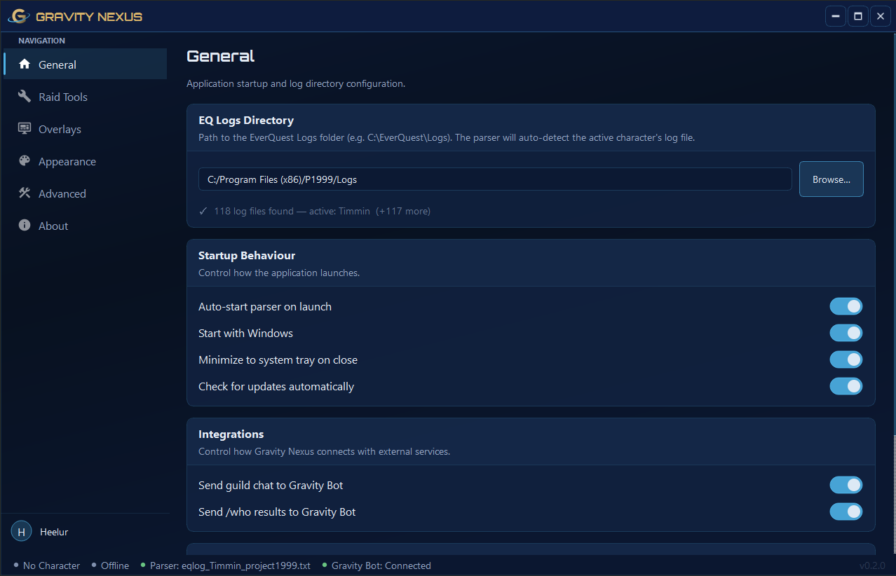
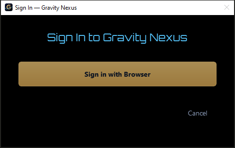
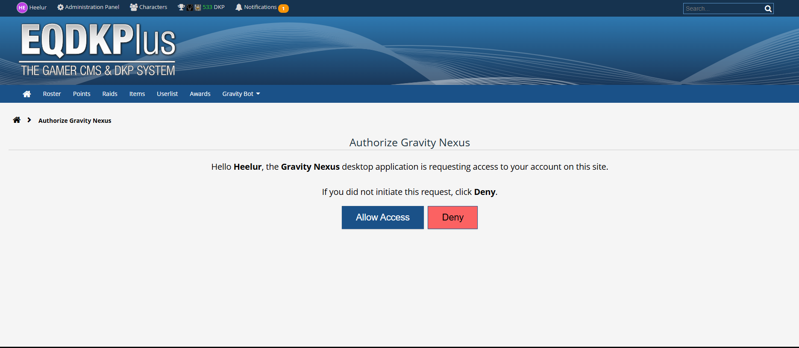
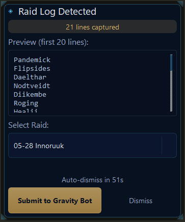
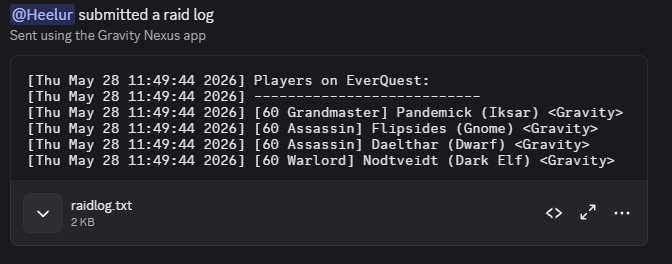
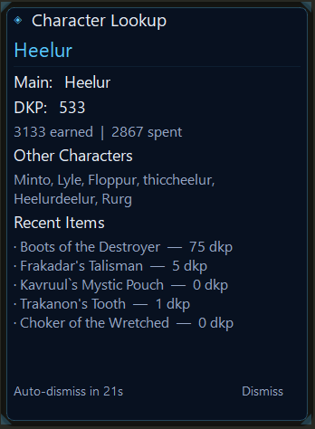
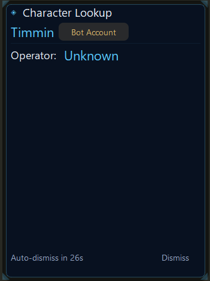
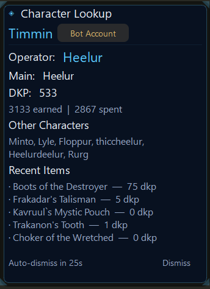

# Gravity Nexus

Gravity Nexus is a desktop companion app for Gravity guild members. It provides in-game tools like raid log submission, character lookup, and more. It integrates with Gravity Bot and the DKP website. Similar to EQ Tools, GINA, or Pulse, it works by reading your log files.

 

---

## Installation

### Requirements

- Windows 10 or later
- Given the `Gravity Nexus Users` role on the dkp website. (Ask admin for access)

### Steps

1. Download the latest `GravityNexus_Setup_x.x.x.exe` installer from the [Releases](https://github.com/GravityGuild/gravity_nexus/releases) page.
2. Run `GravityNexus_Setup_x.x.x.exe` and follow the on-screen prompts.
3. Launch **Gravity Nexus** from the Start Menu or Desktop shortcut.

---

## Setup & Configuration

### First Launch

1. **Sign in** — On first launch you will be prompted to sign in. Click **Sign in with Browser** and complete the login on the Gravity DKP site. The app will detect the successful login automatically.

2. **Setup Wizard** — After signing in, a one-time setup wizard will guide you through:
   - **EQ Logs Directory** — Point Gravity Nexus to your EverQuest `Logs` folder (e.g. `C:\EverQuest\Logs`). The app auto-detects your character's log file.
   - **Startup Preferences** — Choose whether to start with Windows, minimize to tray on close, and auto-start the log parser.

3. **You're ready** — All preferences can be changed later.

---

## Features

### Update From Within the App

Gravity Nexus can check for new releases automatically and update itself.

To update your version go to General → Software Updates.

### Authentication via gravityp99.com

Gravity Nexus uses our DKP website https://gravityp99.com/ to authenticate. Once you're authenticated the app knows who you are and what discord roles you have.

When authentication is needed this window will appear

Clicking "Sign in with Browser" will take you to the DKP website where you can log in normally or if you're already logged 
in will display this page asking for permission to authenticate. Click "Allow Access" and you're authenticated.

### Guild Chat Stream Forwarding

Gravity Nexus app will forward guild chat messages to the bot so they can be displayed in guild-chat-stream in discord. As long as one person with gravity nexus is online we will have guild chat stream messages.

This feature is on by default, and you don't need to do anything for it to work other than being in game on a guild tagged character. 

### Guild Bot Status and Operators

Gravity Nexus will automatically update gravity bot whenever you log into a bot or when you log out of a bot. This lets gravity bot 
provide better feedback about which bots are currently taken and who is currently on a bot.

Gravity Nexus also updates gravity bot when you take a /who in game and guild bots appear on the list. So if someone is wondering 
what bots are available you can do a `/who all guild` in game to let gravity bot know what characters are still in game.

### Raid Log Capture

Capture raid attendance using `/who` in game and submit the logs directly to raid logs in discord.

**How to use:**

1. Type `/t nexusraidlog` in EverQuest chat to start a raid log capture.
2. Type `/who` to take the raid log.

> [!TIP]
> Combine the two commands into a social for easy one-button use.

3. The **Raid Log** overlay will appear — select the raid from the dropdown and press **Submit to Gravity Bot**.

  

4. The raid logs will appear in discord and attendance will be updated.

  

**Quick Raid Logs** — When enabled (Raid Tools → Raid Log Capture → Settings), typing `/who` twice within 5 seconds will automatically trigger a capture without needing the `/t nexusraidlog` step.

### Who Character Lookup

Display character data (DKP, alts, recent items) in an overlay when doing `/who character` in game.

> [!TIP]
> Target a character and use `/whot` to easily do a lookup

#### Character Lookup

The fields that are displayed when looking up a character can be configured in Raid Tools → Who Character Lookup → Settings

#### Bot Lookup (Unknown Operator)

#### Bot Lookup (Known Operator)

