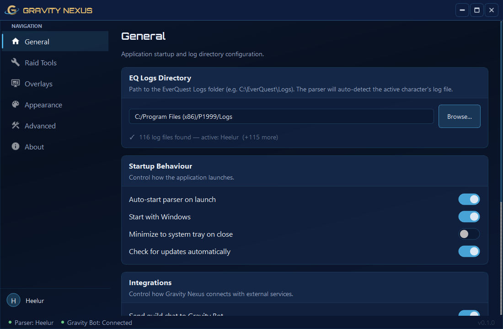

# Gravity Nexus

Raid tools and integration with Gravity's Discord bot and DKP website, for Project 1999.

---

## Table of Contents

- [Installation](#installation)
- [Setup & Configuration](#setup--configuration)
- [Features](#features)
  - [Raid Tools](#raid-tools)
  - [Gravity Bot Integration](#gravity-bot-integration)
  - [Overlays](#overlays)
- [Developers](#developers)

---

## Installation

### Requirements

- Windows 10 or later
- Given the `Gravity Nexus Users` role on the dkp website. (Ask admin for access)

### Steps

1. Download the latest `GravityNexus_Setup_x.x.x.exe` installer from the [Releases](https://github.com/GravityGuild/gravity_nexus/releases) page.
2. Run `GravityNexus_Setup_x.x.x.exe` and follow the on-screen prompts.
3. Launch **Gravity Nexus** from the Start Menu or Desktop shortcut.

---

## Setup & Configuration

### First Launch

1. **Sign in** — On first launch you will be prompted to sign in. Click **Sign in with Browser** and complete the login on the Gravity DKP site. The app will detect the successful login automatically.

2. **Setup Wizard** — After signing in, a one-time setup wizard will guide you through:
   - **EQ Logs Directory** — Point Gravity Nexus to your EverQuest `Logs` folder (e.g. `C:\EverQuest\Logs`). The app auto-detects your character's log file.
   - **Startup Preferences** — Choose whether to start with Windows, minimize to tray on close, and auto-start the log parser.

3. **You're ready** — All preferences can be changed later.

## Features

- **Software updates** — Gravity Nexus can check for and install new releases automatically. To update your version go to Settings → General → Software Updates.
- **Guild Chat Stream Forwarding** — Gravity Nexus app will forward guild chat messages to the bot so they can be displayed in guild-chat-stream in discord. As long as one person with gravity nexus is online we will have guild chat stream messages.
- **Raid Log Capture** — Capture raid logs in game using /who and Gravity Nexus will open a popup window to let you submit them directly to the bot. No more saving logs and manually uploading them.
- **Authentication via gravityp99.com** — As long as you're logged into the website authentication is as easy as clicking a button and then Gravity Nexus knows who you are and what discord roles you have

### Raid Tools

The **Raid Log Capture** tool captures raid attendance from `/who` output and submits it to the Gravity Discord bot.

**How to use:**

1. Type `/t nexusraidlog` in EverQuest chat to start a raid log capture.
2. Type `/who` to take the raid log.
3. The **Raid Submit** overlay will appear — select the raid from the dropdown and confirm.

> **Tip:** Combine the two commands into a social for easy one-button use.

**Quick Raid Logs** — When enabled (Settings → Raid Tools), typing `/who` twice within 5 seconds will automatically trigger a capture without needing the `/t nexusraidlog` step.

### Gravity Bot Integration

Gravity Nexus connects to the Gravity Bot to relay in-game events to Discord.

- **Guild chat relay** — Guild chat lines are forwarded to the bot in real time so they can be displayed in the guild-chat-stream channel  (toggle in Settings → General).

### Overlays

**Positioning overlays:** Go to **Settings → Overlays** and click **Position Overlays** to drag all overlays to your preferred screen positions. Click **Save Positions** when done.

Global overlay options include enabling/disabling all overlays and adjusting opacity.

